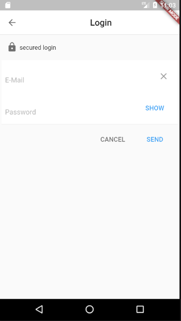
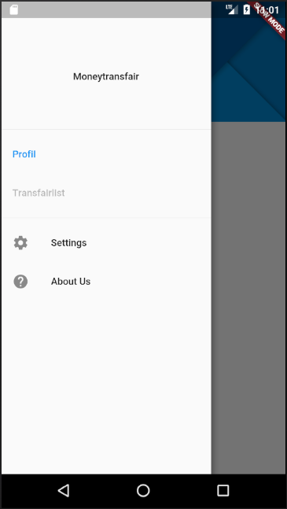
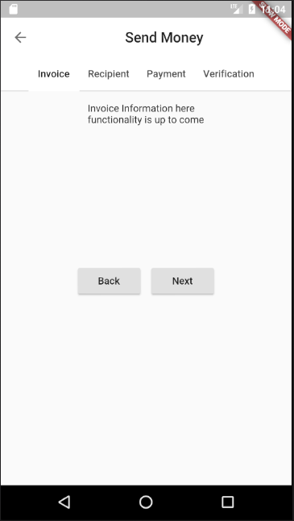

# MoneyTransfair : low cost Money Transfer

## System installation
1. Install [Git](https://git-scm.com/book/en/v2/Getting-Started-Installing-Git)

2. Setup your environment [Flutter](https://flutter.io/setup/)

3. Clone the Project [motradis](https://github.com/merlinfotsing/motradis.git)
* $ cd c:/dev/
* $ git clone https://github.com/merlinfotsing/motradis.git

4. Set up your [Android device](https://flutter.io/setup-windows/#system-requirements) 

5. Run and Enjoy the Application 

## They app in image
## Home

## Login

## Menu

## Moneytransfer
